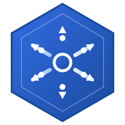

<p align="center">
  
</p>

<h1 align="center">Jetpath</h1>

<p align="center">
  <strong>Ultra-Fast Load Balancing at Wire Speed</strong>
</p>

<p align="center">
  <a href="https://app.swaggerhub.com/apis/Edgenexus/Jetpath/1.0.0"></a>
  <a href="https://hub.docker.com/r/edgenexus/jetpath"></a>
  <a href="https://github.com/edgeNEXUS/Jetpath_Public/releases"></a>
</p>

---

## ⚡ What is Jetpath?

**Jetpath** is a next-generation load balancer that processes traffic directly in the Linux kernel, delivering **10x faster performance** than traditional solutions like NGINX or HAProxy.

With sub-microsecond latency and millions of packets per second throughput, Jetpath is built for modern cloud-native infrastructure.

## 🚀 Why Jetpath?

| Feature | Description |
|---------|-------------|
| ⚡ **Blazing Fast** | Kernel-level packet processing at line rate (10M+ pps) |
| 🌍 **Layer 7 Intelligence** | HTTP host and path routing, SNI-based TLS routing |
| 🛡️ **Built-in DDoS Protection** | Rate limiting, SYN flood protection, IP blacklisting |
| 🌐 **Full IPv4/IPv6 Support** | Dual-stack networking out of the box |
| ☸️ **Kubernetes Native** | Automatic Service/Endpoint synchronization |
| 🔄 **Smart Load Balancing** | Round robin, weighted, least connections, session persistence |
| 🚀 **Zero-Copy Forwarding** | Direct Server Return (DSR) for maximum efficiency |

## 📊 Performance

| Metric | Value |
|--------|-------|
| TCP Connect Latency | ~80 µs |
| Full HTTP Request | ~450 µs |
| HTTP Host Routing | <10 µs additional |
| Throughput | 1M+ packets/sec |

## 📦 Installation

### Docker (Quickstart)

```bash
docker run -d --privileged --network host edgenexus/jetpath
```

### Kubernetes (Helm)

```bash
helm repo add jetpath https://helm.edgenexus.io
helm repo update
helm install jetpath jetpath/jetpath \
  --namespace jetpath-system \
  --create-namespace
```

### Binary Installation

Download the binaries from the [`binaries/`](./binaries) directory:

```bash
# Copy XDP program and loader
sudo cp binaries/*.o /opt/jetpath/xdp/
sudo cp binaries/loader /opt/jetpath/xdp/
chmod +x /opt/jetpath/xdp/loader

# Load XDP program on interface
sudo /opt/jetpath/xdp/loader --iface eth0
```

## 🛠️ Quick Start

### 1. Check System Status

```bash
curl http://localhost:8080/v1/status | jq
```

### 2. Create a Load Balancer Service

```bash
curl -X POST http://localhost:8080/v1/services?instance_id=main \
  -H "Content-Type: application/json" \
  -d '{
    "name": "web-service",
    "protocol": "tcp",
    "listeners": [{"vip": "10.0.0.100", "port": 80}],
    "lb_policy": {"type": "round_robin"},
    "destinations": [
      {"id": "web-1", "ip": "10.0.0.10", "port": 8080},
      {"id": "web-2", "ip": "10.0.0.11", "port": 8080}
    ]
  }'
```

### 3. Configure DDoS Protection

```bash
curl -X PUT http://localhost:8080/v1/ddos/rate-limit?instance_id=main \
  -H "Content-Type: application/json" \
  -d '{"enabled": true, "pps": 50000, "burst": 100000}'
```

## 📖 Documentation

| Resource | Link |
|----------|------|
| **API Reference** | [SwaggerHub](https://app.swaggerhub.com/apis/Edgenexus/Jetpath/1.0.0) |
| **OpenAPI Spec** | [`docs/jetnexus_openapi.yaml`](./docs/jetnexus_openapi.yaml) |
| **Helm Chart** | [`docs/HELM.md`](./docs/HELM.md) |

## ☸️ Kubernetes Integration

Annotate your Kubernetes Services for automatic Jetpath configuration:

```yaml
apiVersion: v1
kind: Service
metadata:
  name: my-app
  annotations:
    jetpath.io/enabled: "true"
    jetpath.io/lb-policy: "least_connection"
    jetpath.io/persistence: "source"
    jetpath.io/forwarding-mode: "dsr"
spec:
  selector:
    app: my-app
  ports:
    - port: 80
      targetPort: 8080
```

## 🏢 About EdgeNEXUS

Jetpath is developed by [EdgeNEXUS](https://edgenexus.io), a leader in high-performance application delivery solutions.

---

<p align="center">
  <sub>© 2026 EdgeNEXUS Limited. All rights reserved.</sub>
</p>

